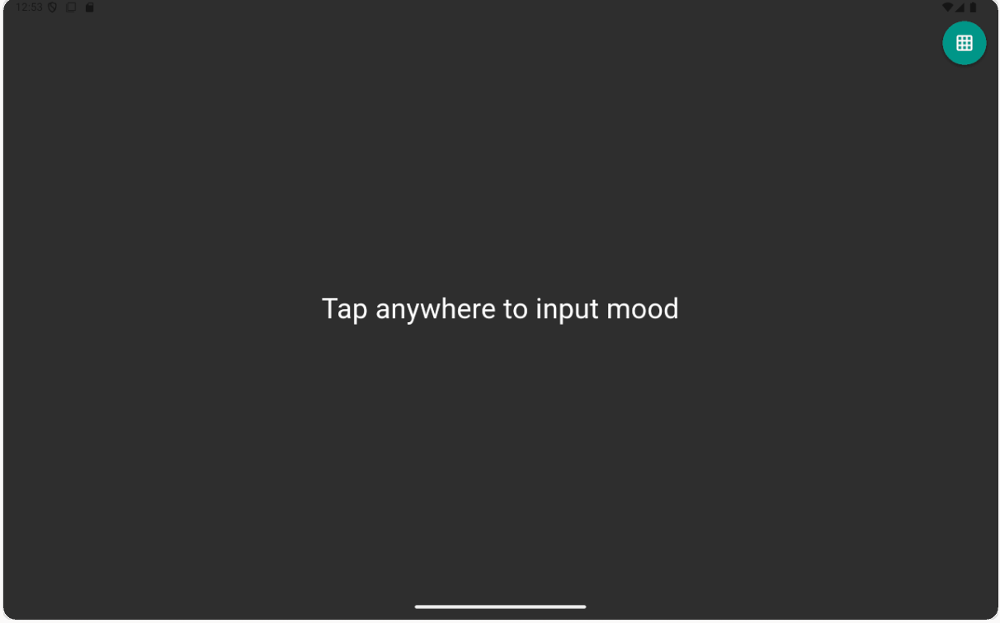
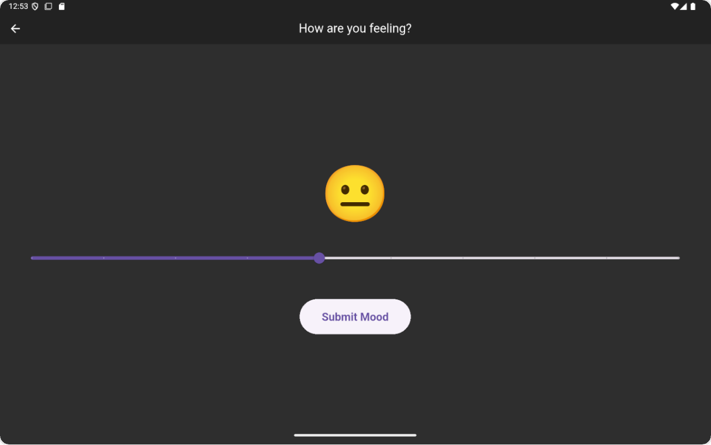
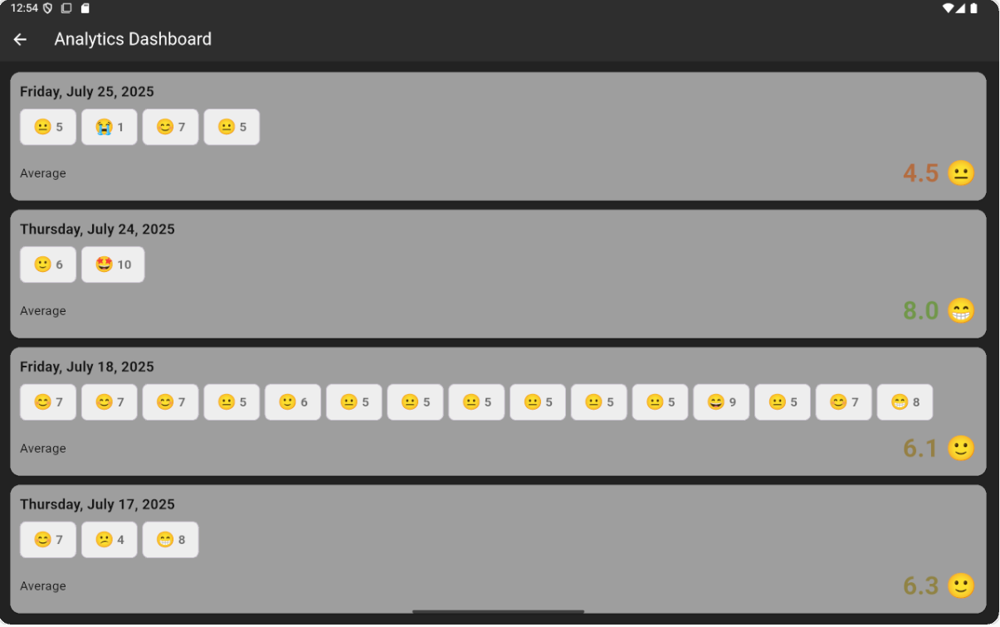

# 🌤️ Mood Tracker App

A simple, minimalist Flutter app to help you log moods daily and visualize emotional trends over time.

---

## 📱 Screenshots

### 🏠 Start Screen
Tap anywhere to quickly begin logging your mood.

---

### 😊 Mood Input
Select your current mood on a scale from 1 (😭) to 10 (🤩) using intuitive emoji-based input.

---

### 📊 Analytics Dashboard
View mood data, daily averages in a clean layout.

---

## ✨ Features

- 🔘 One-tap mood logging with emojis
- 📆 Mood tracking and visualization
- 📊 Automatic average calculations per day

---
